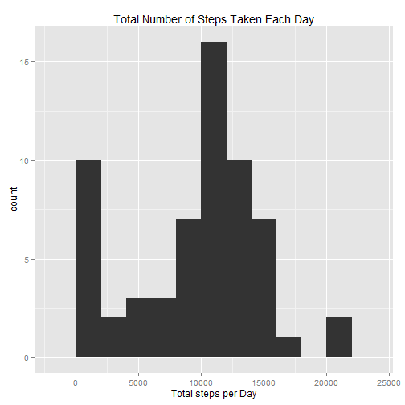
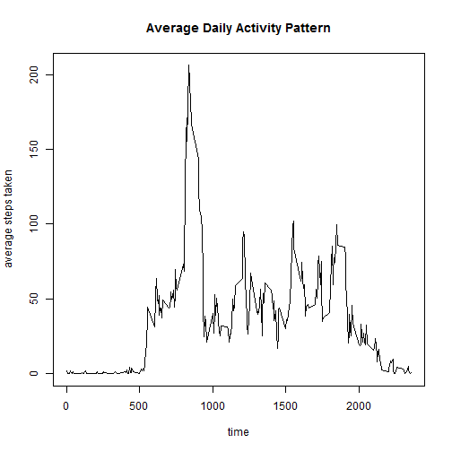
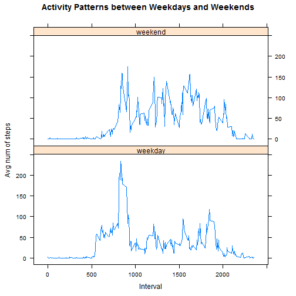

## Loading and preprocessing the data

```r
steps <- read.csv("activity.csv")
steps$date <- as.Date(steps$date)
```


## What is mean total number of steps taken per day?
### A histogram of the total number of steps taken each day

```r
stepsByDate <- split(steps$steps, steps$date)
sumByDate <- sapply(stepsByDate, sum, USE.NAMES = TRUE, na.rm=TRUE)

library(ggplot2)
qplot(sumByDate, bin = 2000, main="Total Number of Steps Taken Each Day", xlab=
          "Total steps per Day")
```

 

### The mean and median of the total number of steps taken per day

```r
totalStepsMean <- mean(sumByDate)
totalStepsMean
```

```
## [1] 9354.23
```

```r
totalStepsMedian <- median(sumByDate)
totalStepsMedian
```

```
## [1] 10395
```


## What is the average daily activity pattern?
### A time series plot of the 5-minute interval and the average number of steps taken, averaged across all days 

```r
stepsByInt <- split(steps$steps, steps$interval)
meanByInt <- sapply(stepsByInt, mean, USE.NAMES = TRUE, na.rm=TRUE)
meantime <- as.numeric(names(meanByInt))
plot(meantime, meanByInt, type="l", main="Average Daily Activity Pattern", 
     xlab="time", ylab="average steps taken")
```

 

```r
dev.off()
```

```
## null device 
##           1
```

### Which 5-minute interval, on average across all the days in the dataset, contains the maximum number of steps?

```r
maxInd <- which.max(meanByInt)
names(maxInd)
```

```
## [1] "835"
```


## Imputing missing values
### The total number of missing values in the dataset

```r
sum(is.na(steps$steps))
```

```
## [1] 2304
```

### A new dataset with all of the missing values filled in using the mean for that 5-minute interval.

```r
stepsNaInd <- which(is.na(steps$steps))
stepsNoNA <- steps
for (i in stepsNaInd){
    curTime <- stepsNoNA$interval[i]
    avgAtInt <- meanByInt[as.character(curTime)]
    stepsNoNA$steps[i] <- avgAtInt
}
```

### New sum for the imputed dataset 

```r
stepsByDateNoNA <- split(stepsNoNA$steps, stepsNoNA$date)
sumByDateNoNA <- sapply(stepsByDateNoNA, sum, USE.NAMES = TRUE)
```

### Summary of the Imputed data set

* A histogram of the total number of steps taken each day

```r
qplot(sumByDateNoNA, bin = 2000, 
main="Total Number of Steps Taken Each Day (NA Imputed)", xlab="Total steps per Day")
```

 

* the mean and median total number of steps taken per day

```r
totalStepsMeanNoNA <- mean(sumByDateNoNA)
totalStepsMeanNoNA
```

```
## [1] 10766.19
```

```r
totalStepsMedianNoNA <- median(sumByDateNoNA)
totalStepsMedianNoNA
```

```
## [1] 10766.19
```

* comparing with the original data set:  
  After imputing the dataset, both the mean and the median increase.  This is expected because the missing values were treated as 0 before, but are now replaced with its correspoinding 5-minute-interval average.  


## Are there differences in activity patterns between weekdays and weekends?
### Creating a new factor variable in the dataset indicating whether a given date is a weekday or weekend day.

```r
for (i in 1:length(steps$date)){
    steps$wday[i] <- if( weekdays(steps$date[i]) == "Saturday" || 
                         weekdays(steps$date[i]) == "Sunday" ) "weekend" else "weekday"
}
steps$wday <- as.factor(steps$wday)
```

### Time series plots of the average number of steps taken between weekdays and weekends

```r
library(dplyr)
```

```
## Warning: package 'dplyr' was built under R version 3.2.2
```

```
## 
## Attaching package: 'dplyr'
## 
## The following objects are masked from 'package:stats':
## 
##     filter, lag
## 
## The following objects are masked from 'package:base':
## 
##     intersect, setdiff, setequal, union
```

```r
stepMeans <- steps %>% group_by(wday, interval) %>% summarise(steps=mean(steps, na.rm=TRUE))
library(lattice)
xyplot(steps ~ interval| wday, data = stepMeans,type = "l",xlab = "Interval", 
       ylab = "Avg num of steps", main=
           "Activity Patterns between Weekdays and Weekends", layout=c(1,2))
```

 
